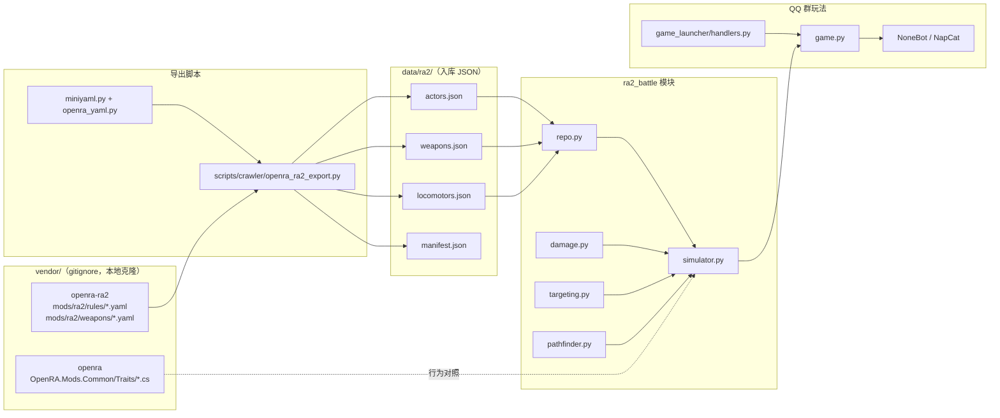

# 红警2斗蛐蛐 —— 工程文档

- **Status**: Draft v10（动态 Targetable / 多弹头 / 出战星级）
- **Last Updated**: 2026-05-22（§3.5 YR 数据源调研）
- **Game ID**: `ra2_battle`
- **权威数据**: [OpenRA/ra2](https://github.com/OpenRA/ra2) mod yaml（经 `vendor/openra-ra2` 导出）

---

## 零、独立性声明（与 `aoe3_battle` 无关）

`ra2_battle` 与 `aoe3_battle`（帝国3电子斗蛐蛐）是**完全独立**的两个游戏模块，**不得复用**对方的模拟器、数据或群指令逻辑。

| 维度 | `aoe3_battle` | `ra2_battle` |
|------|---------------|--------------|
| Game ID | `aoe3_battle` | `ra2_battle` |
| 群指令 | `@我 斗蛐蛐` / `@我 斗蛐蛐 单挑` | `@我 红警斗蛐蛐` / `@我 红警斗蛐蛐 单挑` |
| 数据来源 | 自建 AoE3 单位 JSON（`src/plugins/aoe3/`） | OpenRA RA2 yaml → `data/ra2/*.json` |
| 数据管线 | 手工维护 / 爬虫 | `openra_ra2_export.py` + MiniYaml 解析 |
| 战场模型 | **一维**直线对冲（`FIELD_LENGTH`） | **二维**格点舞台（`CPos` / WDist） |
| 模拟基准 | **非** OpenRA 运行时；Python 读导出数据 + 对齐 Trait | 见下文「对齐 / 简化 / 禁止」三节 |
| 群玩法入口 | `game.py` + `game_launcher` | `game.py` + `game_launcher`（`handlers.py`） |
| 插件包路径 | `src/plugins/games/aoe3_battle/` | `src/plugins/games/ra2_battle/` |

两者仅在**产品形态**上类似（押注 → 开战 → 模拟 → 播报 → 结算），底层实现零共享。

---

## 一、系统架构



数据流：**vendor yaml → export → JSON → repo 加载 → BattleSimulator →（未来）game.py 播报 → QQ 群**。

---

## 二、目录结构

```
QQBotForFun/
├── vendor/                              # gitignore；OpenRA 参考源码
│   ├── openra-ra2/                      # RA2 mod 规则与武器
│   └── openra/                          # OpenRA 引擎 Trait 源码（对照用）
├── data/ra2/                            # 导出产物（建议入库）
│   ├── manifest.json
│   ├── actors.json
│   ├── weapons.json
│   └── locomotors.json
├── scripts/
│   ├── setup_openra_vendor.ps1          # 克隆 vendor 仓库（Windows）
│   ├── crawler/
│   │   └── openra_ra2_export.py         # yaml → JSON 导出
│   └── ra2_battle_sim.py                # 无 GUI CLI 对战
├── tests/games/ra2_battle/
│   ├── test_basic.py                    # 伤害 / 对战 smoke test
│   └── test_weapons.py                  # 武器 ValidTargets / 用途
└── src/plugins/games/ra2_battle/
    ├── __init__.py                      # 加载 game + commands
    ├── game.py                          # @register_game 群玩法
    ├── commands.py                      # 押注 / 开战
    ├── lineup.py / display.py / broadcaster.py
    ├── constants.py                     # WDist、tick、舞台尺寸
    ├── miniyaml.py                      # OpenRA MiniYaml 轻量解析
    ├── openra_yaml.py                   # 规则合并、WDist、Trait 抽取
    ├── battle_pool.py                   # 斗蛐蛐池 + 黑名单
    ├── repo.py                          # JSON → dataclass 加载
    ├── damage.py                        # DamageWarhead.Versus
    ├── targeting.py                     # AutoTarget / Armament 条件
    ├── pathfinder.py                    # 四向 A*
    └── simulator.py                     # BattleSimulator 主循环
```

群玩法模块：`game.py`、`commands.py`、`lineup.py`、`display.py`、`broadcaster.py` 已接通 QQ 链路（见 §八）。

---

## 三、数据管线

### 3.1 MiniYaml 解析（`miniyaml.py`）

OpenRA 规则文件使用 **Tab 缩进**的 MiniYaml 格式（非标准 YAML）。`parse_miniyaml()` 支持：

- Tab 层级嵌套
- 值内可含冒号（按首个 `:` 分割 key / value）
- 标量类型：`int` / `float` / `bool`（yes/no）/ 引号字符串
- **标量提升**：`Key: value` 下再接子节点时，合并为 `{"@value": scalar, ...}`（与 OpenRA 行为一致）

`openra_yaml.py` 在此基础上提供：

| 函数 | 作用 |
|------|------|
| `load_rules_dir()` | 合并 `mods/ra2/rules/*.yaml` → `actor_id → node` |
| `load_weapons_dir()` | 合并 `mods/ra2/weapons/*.yaml` |
| `merge_actor()` / `merge_weapon()` | `Inherits` 链深度合并 + `-Trait` 移除 |
| `parse_wdist()` | `5c768` → `5×1024+768` WDist 整数 |
| `trait_blocks()` | 抽取 `Armament@*`、`AutoTargetPriority@*` 等 |
| `split_csv()` | 逗号分隔 Trait 字段 |

### 3.2 导出脚本（`openra_ra2_export.py`）

```bash
uv run python scripts/crawler/openra_ra2_export.py
uv run python scripts/crawler/openra_ra2_export.py --vendor path/to/openra-ra2
```

**处理流程**：

1. 读取 `vendor/openra-ra2/mods/ra2/rules/` 与 `weapons/`
2. 合并 `^BaseWorld` 导出 **Locomotor**（`world.yaml`）
3. 遍历武器：合并继承 → 导出 `Warhead@*Dam`（含 `Versus`）
4. 遍历 actor：应用 `_is_battle_pool()` 过滤 → 导出作战单位

**入池过滤 `_is_battle_pool()`**（同时满足）：

- 含 `Health` + `Mobile` + `Buildable`（可建造作战单位）
- `MapEditorData.Categories` 不含 `structure` / `building`

跳过 `^` 开头的模板 id；武器同样跳过 `^` 前缀。

**当前导出规模**（示例）：45 单位、103 武器、8 Locomotor（见 `manifest.json`）。

### 3.3 JSON Schema 字段

#### `manifest.json`

| 字段 | 说明 |
|------|------|
| `source` | 固定 `"OpenRA/ra2"` |
| `vendor_path` | 导出时 vendor 绝对路径 |
| `exported_at` | UTC ISO 时间戳 |
| `actor_count` / `weapon_count` / `locomotor_count` | 条目数 |

#### `locomotors.json` — `locomotor_name → object`

| 字段 | 类型 | 来源 |
|------|------|------|
| `name` | string | `Locomotor@*.Name` |
| `shares_cell` | bool | `SharesCell` |
| `crushes` | string[] | `Crushes` CSV |

#### `actors.json` — `actor_id → object`

| 字段 | 类型 | 来源 Trait |
|------|------|------------|
| `id` | string | actor id |
| `name` | string | `Tooltip.Name` |
| `cost` | int | `Valued.Cost` |
| `hp` | int | `Health.HP` |
| `armor` | string | `Armor.Type` |
| `speed` | int | `Mobile.Speed` |
| `locomotor` | string | `Mobile.Locomotor` |
| `shares_cell` | bool | 对应 Locomotor |
| `crushes` | string[] | 对应 Locomotor.Crushes |
| `target_types` | string[] | 斗蛐蛐**默认态**下成立的 `TargetTypes`（`_targetable_active`） |
| `targetable_layers` | array | 全部 `Targetable@*`：`{id, types, requires_condition}` |
| `crushable` | bool | 是否存在 `Crushable` |
| `armaments` | array | `Armament@*` → `{id, weapon, requires_condition, name}` |
| `auto_target_priorities` | array | `AutoTargetPriority@*` 或 fallback |
| `categories` | string | `MapEditorData.Categories` |

#### `weapons.json` — `weapon_id → object`

| 字段 | 类型 | 来源 |
|------|------|------|
| `id` | string | weapon id |
| `reload_delay` | int | `ReloadDelay`（tick 数，直接用） |
| `range` / `min_range` | int \| null | WDist |
| `burst` | int | `Burst` |
| `burst_delays` | int[] | `BurstDelays` |
| `valid_targets` | string[] | 武器 `ValidTargets`（继承合并后） |
| `invalid_targets` | string[] | 武器 `InvalidTargets` |
| `projectile_speed` | int \| null | `Projectile.Speed` |
| `warheads` | array | `{id, type, damage, versus, spread, falloff, delay}` |

`versus` 为 `{armor_type: percent}`，100 = 无修正；计算结果为 0 时不扣血（对齐免疫/0% Versus）。  
yaml **未写** `ValidTargets` 时，运行时按 OpenRA `WeaponInfo` 默认 **`Ground, Water`**（见 `vendor/openra/OpenRA.Game/GameRules/WeaponInfo.cs`）。

### 3.4 斗蛐蛐阵容池与黑名单

| 集合 | 说明 | 代码 |
|------|------|------|
| **导出全集** | `actors.json` 全部可建造单位 + `spawn_only` 子机 | `load_actors()` |
| **斗蛐蛐池** | 可随机/押注阵容 | `lineup_eligible_*()` / `load_battle_pool_actors()` |
| **黑名单** | 明确不参与随机的 id | `battle_pool.LINEUP_BLACKLIST` |

入池条件（`is_lineup_eligible()`）：

- 非 `spawn_only`（如 `hornet`、`asw` 子机仅战中生成）
- 有至少一个 `Armament`（能开火）
- `cost > 0`
- 不在黑名单
- 非纯 `Aircraft` + `locomotor=aircraft`（平地斗蛐蛐不随机到仅能空中机动的飞机；**航母/神盾/海豚等仍入池**）

**黑名单**（随机不到，但可 CLI 手动指定测试）：

| id | 原因 |
|----|------|
| `engineer` | 工程师，无武器 |
| `spy` | 间谍，无武器 |
| `amcv` / `smcv` | 基地车（MCV） |
| `cmin` | 盟军超时空采矿车（无武器） |
| `lcrf` / `sapc` | 两栖/装甲运输，无武器 |

**入池但易误解**：`harv`（苏军武装矿车 / War Miner，有 `20mmrapid`）**可**随机到。

**池内特殊兵种**（已实现机制，需覆盖测试）：`yuri` / `ptroop`（心控）、`carrier`（黄蜂）、`deso`、`ttnk`、`apoc`、`htk`、`aegis`、`sub`、`ccomand` / `cleg`、`dog`、`dtruck`、`terror`、`tany`、`mgtk`、`sref` 等。见 `tests/games/ra2_battle/test_coverage.py`。

### 3.5 尤里复仇（YR）数据源调研（GitHub）

当前 `vendor/openra-ra2`（[OpenRA/ra2](https://github.com/OpenRA/ra2)）**没有**尤里第三阵营完整兵种表，仅有战役/心控相关零散单位（如 `yuri`、`yuripr`、`ptroop`）。**不是导出漏了，是上游 mod 未做 YR 阵营。**

| 仓库 | 类型 | 是否可用于 `openra_ra2_export.py` | 说明 |
|------|------|-----------------------------------|------|
| [OpenRA/ra2](https://github.com/OpenRA/ra2) | 官方 RA2 mod（现用） | ✅ 已用 | 苏军/盟军/海军/部分心控单位 |
| **[cookgreen/Yuris-Revenge](https://github.com/cookgreen/Yuris-Revenge)** | OpenRA 引擎 YR 完整 mod | ⚠️ 需单独对接 | **首选**：`mods/yr/rules/yuri-infantry.yaml`（`init`、`brute`、`virus`…）、`yuri-vehicles.yaml`（`ltnk`、`ytnk`、`tele`、`mind`、`disk`、`smin`…）、`yuri-naval.yaml`；含 `OpenRA.Mods.YR.dll` 自定义 Trait |
| [Cheesy0314/OpenRA2](https://github.com/Cheesy0314/OpenRA2) | 同类 YR 复刻 | ⚠️ 类似 | 活跃度低于 cookgreen |
| CnCNet/yr-patches、mbnq/RA2YRBF 等 | 原版 `rules.ini` / Ares | ❌ | 非 OpenRA MiniYaml，不能直喂当前导出脚本 |

**cookgreen/Yuris-Revenge 要点**（2026-05 调研）：

- 许可：GPL-3.0；引擎钉在较老 `release-20200503`；需自备原版 RA2+YR `.mix`（见仓库 Wiki）
- 规则示例：`init` 新兵、`brute` 狂人、`virus` 病毒狙击手、`ltnk` 鞭状坦克、`ytnk` 盖特（多阶段炮管）、`tele` 磁能、`mind` 心灵控制车、`disk` 飞碟
- 矿车命名与现用 ra2 一致：`harv` = 苏军武装矿车（有炮，可入池）；盟军超时空矿车在 YR 侧为 `cmin` 类逻辑（无武器，应黑名单）
- **接入成本**：除扩展 export 读 `mods/yr/rules` 外，磁能/飞碟/盖特升级/混沌气等依赖 `OpenRA.Mods.YR` C# Trait，Python 模拟器需分批实现或降级为「能开火部分」

**若后续做 YR**：建议 `vendor/yuris-revenge` 子目录 + 第二导出源或合并 manifest；斗蛐蛐池继续用 `battle_pool` 黑名单；Trait 优先级见 §4.5。

---

## 四、设计原则：什么能对齐、什么能简化

### 4.1 目标定位

| 层级 | 说明 |
|------|------|
| **理想** | 等价于后台跑 OpenRA/ra2，双方自动对冲 |
| **现状** | **不嵌入** OpenRA 引擎；`vendor/openra-ra2` yaml → export → Python `BattleSimulator` |
| **底线** | **兵种/武器逻辑不得手编、不得擅自简化战斗机制**；仅舞台/经济/UI 等非战斗项可简化并文档化 |
| **军衔** | **默认战中升级**（`GainsExperience`）；支持出战初始星级 `1–3`（`army` 第三元，后续 QQ 阵容 UI 接） |

### 4.2 禁止简化（必须跟仓库 + 引擎定义）

| 项 | 实现 | vendor 查阅路径 |
|----|------|-----------------|
| 武器能否打该目标 | `targeting.weapon_valid_against()` ≈ `WeaponInfo.IsValidTarget` | `weapons/*.yaml`，`WeaponInfo.cs` |
| 伤害 / Versus / 射程 / 装填 / Burst | `damage.py`，`simulator` | `weapons/*.yaml`，`Armament.cs` |
| 单位能否被自动瞄准 | `targeting.can_auto_target()` | `rules/*.yaml` `AutoTargetPriority@DEFAULT` |
| 多 `Armament` | 每炮独立装填；`AttackBase.DoAttack` 式齐射 | `soviet-vehicles.yaml` `apoc`，`AttackBase.cs` |
| 军衔 / 精英炮 | `experience.py` + `armament_allowed(veterancy_level)` | `^GainsExperience`，`GainsExperience.cs` |
| 击杀经验 | 击杀获得 `Cost` 经验，阈值 `条件%×Cost` | `GivesExperience.cs` |

**若因斗蛐蛐舞台被迫修改上表任一条，必须先改文档并说明原因。** 不得用「简化战斗」规避上表。

### 4.3 允许简化（斗蛐蛐产品规则，非 RA2 兵种逻辑）

| 项 | 默认值 | 说明 |
|----|--------|------|
| 地形 | 全平地 | 无悬崖/建筑/资源 |
| 海军舞台 | 舰只也在陆网格移动 | **不**改武器 `ValidTargets`；仍按 yaml |
| 出生 | 红 `x=2`，蓝 `x=W-3` | 布局 |
| 终局 | 一方全灭；`MAX_TICKS` 平局 | |
| 无 UI / 无经济 | — | |
| 出战星级 | 默认随机 `0/1/3`（红蓝同星）；CLI `id:数量:星级` 用 **0/1/3** | 产品编排，数值仍来自 yaml |

### 4.4 已删除的自研规则（不得回归）

以下曾为修胜负**临时添加**，**不属于** OpenRA，**已移除**：

- `MAX_ATTACKERS_PER_TARGET`（集火名额）
- 强行给 AutoTarget 加 `Water`/`Underwater`
- 按护甲选「伤害最高武器」代替 `IsValidAgainst`
- burst 同一 tick 打满且无 `FireDelay`

### 4.5 与 OpenRA **游戏内**实现的差异（斗蛐蛐舞台外）

下表描述「真实 OpenRA 对战」与当前 `BattleSimulator` 的差距。产品规则（平地、出生等）见 §4.3。

| 维度 | OpenRA 游戏内 | 本模拟器 | 状态 |
|------|---------------|----------|------|
| 架构 | Activity / 单位交错 tick | 每 tick 按 `id` 顺序：各单位 锁敌→移动→攻击，再计时 | **已对齐核心** |
| 移动 | `Mobile.Speed` WDist/tick，`EstimatedMoveDuration = 距离/speed` | `move_progress` 累积，满 `CELL_WDIST` 走一格 | **已对齐核心** |
| 索敌 | `AutoTarget` 按 `ValidTargets` 顺序与权重扫描 | `auto_target_sort_key`：射程内优先 → 类型序 → 距离 → 血量 | **已对齐核心** |
| 弹道 | `Projectile` 按 Speed 飞行后结算 | `PendingHit`，`travel = ⌈dist/speed⌉` tick | **已对齐核心** |
| 弹道拦截 | `Blockable` + `BlocksProjectiles` | 开火/飞行中 `INTERCEPT` | **已对齐**（`Blockable: false` 导弹不拦截） |
| 溅射 | `SpreadDamage` 按 `Spread` WDist | 同格心 + WDist≤spread 的单位 | **已对齐核心** |
| 伤害 | Versus 可为 0 | `calc_damage` 返回 0 时不扣血 | **已对齐** |
| 炮塔 | `AttackTurreted` 转向后才开火 | `Turreted.TurnSpeed` + `FacingTolerance` | **已对齐核心** |
| 弹头 | 多 Warhead 链、延迟弹等 | 主要第一个 Dam 弹头 | **部分** |
| Trait | 空军、心控、修理、变形、建筑… | 未做 | **未实现** |

### 4.6 实现债（仍待对齐）

| 项 | 现状 | 参考 |
|----|------|------|
| 飞机高度 / VTOL 动画 | 子机 `takeoff_ticks` 后视为升空；甲板慢速滑行 | `Aircraft.cs` |

**永久不做（仅舞台/产业）**：地形速度、建筑占领、机场生产链、迷雾 UI。

**已实现**：心控、航母黄蜂、按单位 tick、炮塔转向、`BlocksProjectiles` 弹道拦截、`Rearmable` 补给、`REARM` 事件。

---

## 五、武器用途（示例：天启）

**单位** `apoc`（`vendor/openra-ra2/mods/ra2/rules/soviet-vehicles.yaml`）：

| Armament | 武器 | 继承 / ValidTargets | 用途 |
|----------|------|---------------------|------|
| `Armament@primary` | `120mmx` | ← `120mm`；默认 **Ground, Water** | 对地主炮 |
| `Armament@antiair` | `MammothTusk` | ← **`^AAMissile`**，`ValidTargets: Air` | **只对空** |

模拟器：`simulator._iter_armaments_vs()` 在射程内仍须 `weapon_valid_against_unit(..., target_types=effective_target_types(target))` 为真才开火。  
对犀牛（默认态 `TargetTypes` 含 `Ground, Vehicle`、不含 `Air`）**只会**用 `120mmx`，**不会**用 `MammothTusk`。

单测：`tests/games/ra2_battle/test_weapons.py`、`test_apoc_vs_htnk_completes`。

---

## 六、OpenRA Trait 对照表（实现状态）

以 `simulator.py` / `damage.py` / `targeting.py` 为准（2026-05-22）。

### 已对齐（核心战斗）

| OpenRA | 模块 |
|--------|------|
| `WeaponInfo.ValidTargets` / `InvalidTargets` | `weapon_valid_against_unit()` + `effective_target_types()` |
| `Targetable` + `RequiresCondition` | `targetable_layers` + `effective_target_types()`（`airborne` / `damaged` / `controlled` 等） |
| `DamageWarhead` + `Versus` | `calc_damage()` |
| `Armament` 装填 / Burst / `FireDelay` | `ticks_since_shot`, `fire_delay`, `burst_left` |
| `AttackBase.DoAttack` 多炮 | `_attack()` → 各 `_check_fire()` |
| `AutoTargetPriority@DEFAULT` | `_priority_active()` + `can_auto_target()` |
| `Targetable` 默认态摘要 | `target_types` ← `_targetable_active()` |
| `Range` / `MinRange` | `_weapon_in_range()` |
| `Crushable` | `_try_crush()` |
| `Mobile.Speed` | `move_progress` + `CELL_WDIST` |
| `Projectile.Speed` | `PendingHit` + `_projectile_travel_ticks()` |
| `SpreadDamage` | WDist≤`spread` |
| `AutoTarget` 类型序 | `auto_target_sort_key()` |
| `GainsExperience` / 倍率 | `UnitVeterancy`，`veterancy.json`，战中升级 |
| `GivesExperience` | 击杀 `Cost` 经验 |
| `Firepower/Damage/Speed/ReloadDelay` 倍率 | `combat_multipliers()` |
| `ChangesHealth@ELITE`（veteran 回血） | `_tick_unit_timers()` |
| `MindController` / `MindControllable` | `mind.py`，`MIND_CONTROL` 事件 |
| `CarrierParent` / `CarrierChild` | `carrier.py`，`hornet`（`spawn_only`）；**航母阵亡时击落全部舰载机**（避免无弹黄蜂拖平局） |
| 按单位 Activity 序 | `_tick_unit()` 按 `id` 交错 |
| `Turreted` | `turret.py` + `geometry.py` |
| `BlocksProjectiles` | `projectile_lane.py`，`INTERCEPT` 事件 |
| `Projectile` Blockable | 仅 `projectile_blockable` 弹道；`BlocksProjectiles` 单位可挡 |
| `Rearmable` | `carrier.tick_rearm`，`REARM` 事件 |
| 舰载机起飞 | `takeoff_ticks`，甲板 `speed/4`；升空后 `Air` Targetable |
| 出战星级 0/1/3 | `BattleSimulator` 第三元；`lineup.roll_initial_stars` + `apply_initial_stars` |
| 多弹头 + `Falloff` | `_fire_one_shot` 按 warhead 排队；`spread_falloff_permille()` |

### 部分实现

| OpenRA | 现状 |
|--------|------|
| `BurstDelays` | 支持 1 项或按发序索引；非全边角 |
| `JamsMissiles` | RA2 规则内无单位携带；未模拟 |

### 未实现

Locomotor 地形减速、Modifier、修理/变形、建筑等。

---

## 七、战场与 Tick 流水线

### 7.1 战场设定

| 参数 | 默认值 | 说明 |
|------|--------|------|
| 舞台尺寸 | 32×16 格 | `DEFAULT_ARENA_W/H`，CLI 可改 |
| 坐标系 | `(x, y)` 格坐标 | 与 OpenRA `CPos` 一致 |
| 距离单位 | WDist | `CELL_WDIST = 1024`（1 格） |
| 地形 | 全体可走 | 无建筑、无资源、无高低差 |
| 同格 | `shares_cell=true` 步兵最多 3 个/格 | `INFANTRY_PER_CELL` |
| 出生 | 红 `x=2`，蓝 `x=W-3`，纵向居中排布 | `_spawn_side()` |

### 7.2 Tick 常量

- **Tick 间隔**：`0.04s`（25 tick/s，与 OpenRA 默认一致）
- **上限**：`MAX_TICKS = 15000`（约 10 分钟）
- **`ReloadDelay`**：直接使用 yaml tick 数，不做额外换算

### 7.3 每 Tick 流水线

实际顺序（`BattleSimulator.run()`）：

```
for tick in 0..max_ticks:
  0. 到期弹道结算 (_process_pending_hits)
  1. 按 unit.id：起飞/补给 → 锁敌 → 炮塔转向 → 移动 → 攻击 (_tick_unit)
  2. 按 unit.id：装填计时 + veteran 回血 (_tick_unit_timers)
  3. 航母补充黄蜂 (_tick_carrier_respawn)
  4. 判定胜负 (_check_winner)
```

开战时 `init_carrier_children` 为 `CarrierParent` 生成 `hornet`（`SPAWN_CHILD`）。

**事件类型**（`EventType`）：`BATTLE_START` → `MOVE` / `ATTACK` / `CRUSH` / `DEATH` → `BATTLE_END`。

索敌：`_acquire_target` 使用 `auto_target_sort_key`（射程内优先 → `AutoTarget` 的 `ValidTargets` 顺序 → 距离 → 当前血量）。

---

## 八、群玩法（QQ Bot）

> **当前状态**：`@register_game` + `bot.py` 加载 + `game_launcher` 快捷开局已接通。与 `aoe3_battle` **不共享** Matcher（`斗蛐蛐` vs `红警斗蛐蛐`）。

### 8.1 指令

| 项 | 值 |
|----|-----|
| Game ID | `ra2_battle` |
| 开局 | `@我 红警斗蛐蛐`（`game_launcher/handlers.py`） |
| 单挑 | `@我 红警斗蛐蛐 单挑` |
| 自定义预算 | `@我 红警斗蛐蛐 3000`（500–50000，默认 5000） |
| 押注 | `@我 1` / `押注1`（红）、`@我 2` / `押注2`（蓝），锁第一笔 |
| 开战 | `@我 开战` |
| 结束 | `@我 结束`（全局） |

对局内由 `commands.py` 注册；**仅本群当前游戏为 `ra2_battle` 时响应**（与帝国共用口令、互不抢单）。

### 8.2 随机阵容与预算（`lineup.py`）

| 项 | 规则 |
|----|------|
| 兵种池 | `battle_pool.is_lineup_eligible()`（约 36 个，见 §3.4） |
| 单方兵种数 | **1 种 / 2 种 各 50%**（不再随机 3 种） |
| 多方数量 | `greedy_fill`：每种保底 1，剩余预算均分 + 零头补最便宜兵种 |
| 单方单兵种 | `预算 // 单价` 取整数量 |
| **单 vs 单 LCM** | 双方各 1 种兵时，`approx_lcm_budget` 调整共用有效预算（±30%），使红蓝**总造价接近**（对齐帝国斗蛐蛐） |
| 出战星级 | 每局 `roll_initial_stars()`：**0 / 1 / 3 等概率**，红蓝**相同**（0=无星，1=一星老兵，3=三星精英） |
| 话术 | VS 条：`⭐ 本局出战：★ 一星（红蓝相同）`；面板标题带星标 |

### 8.3 对阵面板（话术）

结构对齐帝国（🔴1号 / 🔵2号、VS 条、押注提示）。**群消息展示用中文**（`data/ra2/locale_zh.json` + `locale.py`），数值仍来自 OpenRA 导出；英文 yaml 的 `Tooltip.Name` / `Description` 仅作兜底。

- `locale_zh.json` — 45 个导出单位的中文名与说明
- `resources/ra2/icons/{actor_id}.png` — 兵种 cameo 图（对齐帝国斗蛐蛐；见 `resources/ra2/icons/README.md`）
- `display.format_description_blurb` — 优先中文说明，无条目时英译兜底
- `display.format_attack_summary` — 主武器伤害与射程（格）
- `display.format_unit_role` — 步兵/车辆、护甲、可碾压等

**不用**帝国的 `AbstractCavalry` 类型与克制推算。

### 8.4 实现清单

| 组件 | 状态 |
|------|------|
| `BattleSimulator` + 事件流 | ✅ |
| `data/ra2` + `description` 字段 | ✅ |
| `lineup.py` / `display.py` | ✅ |
| `broadcaster.py` | ✅ |
| `game.py`（押注结算同帝国） | ✅ |
| `commands.py`（1/2/开战） | ✅ |
| `game_launcher` + `bot.py` | ✅ |
| 阵容 icon 图片广播 | ✅（需 `ra2_icon_export.py` 生成 PNG） |
| 单位图标 | ⏳ 远期 |

---

## 九、开发 / 运维

### 9.1 初始化 vendor

**Windows（推荐）**：

```powershell
.\scripts\setup_openra_vendor.ps1
```

**推荐布局**：vendor 放在**项目同级目录** `../vendor-openra/`，体积大且与运行时无关，
不入库、不部署。详见 `vendor/README.md`。

```powershell
# Windows 一键
.\scripts\setup_openra_vendor.ps1
```

```bash
# 手动（任意平台）
mkdir ../vendor-openra
git clone --depth 1 https://github.com/OpenRA/ra2.git ../vendor-openra/openra-ra2
git clone --depth 1 https://github.com/OpenRA/OpenRA.git ../vendor-openra/openra
```

可用 `QQBOT_VENDOR` 环境变量自定义路径。脚本与测试通过 `scripts/_vendor_path.py` 统一解析。

### 9.2 导出数据

```bash
uv run python scripts/crawler/openra_ra2_export.py
```

产出写入 `data/ra2/`。若缺少 JSON，`repo.load_actors()` 会提示先运行导出。

更新 OpenRA/ra2 上游后重新导出并跑测试，确认 Versus / 新单位无回归。

### 9.3 CLI 模拟

```bash
# 列出可斗蛐蛐单位（有 armament 的）
uv run python scripts/ra2_battle_sim.py --list

# 3 灰熊 vs 3 犀牛
uv run python scripts/ra2_battle_sim.py --red htnk:3 --blue mtank:3

# 10 G.I. vs 10 动员兵，固定种子
uv run python scripts/ra2_battle_sim.py --red e1:10 --blue e2:10 --seed 42

# 自定义舞台
uv run python scripts/ra2_battle_sim.py --red htnk:1 --blue mtank:1 --width 48 --height 24
```

阵容格式：`actor_id:数量` 或 `actor_id:数量:星级`（星级 **0/1/3**，省略为无星），多方用逗号连接（如 `htnk:2:3,e1:5`）。

### 9.4 测试

```bash
uv run pytest tests/games/ra2_battle/ -v
```

| 测试 | 验证点 |
|------|--------|
| `test_armament_non_elite` | 非精英禁用 `rank-elite` 武器 |
| `test_120mm_vs_heavy` | 120mm 对 Heavy 装甲 = 90 伤害 |
| `test_htnk_vs_mtnk_completes` | 灰熊 vs 犀牛能正常结束 |
| `test_weapon_valid_targets` | 各武器 ValidTargets（天启/防空履带/鱼雷等） |
| `test_mammoth_tusk_not_vs_ground_vehicle` | 导弹不对地面载具 |
| `test_apoc_vs_htnk_completes` | 天启打犀牛只用主炮、不用 MammothTusk |
| `test_airborne.py` | hornet 升空 `Air`、防空炮 ValidTargets、出战 3 星精英开火 |
| `test_intercept.py` | `BlocksProjectiles` 挡 `Blockable` 弹道；`MammothTusk` 不可拦 |
| `test_coverage.py` | 黑名单、阵容池全兵种 smoke、1–3 星、多/少数量、特殊兵种对阵 |

无 `data/ra2/actors.json` 时测试自动 `skip`。

```bash
# 全量抽检（含 35+ 兵种参数化，略慢）
uv run pytest tests/games/ra2_battle/test_coverage.py -v

# 性能 + 固定/随机阵容报告
uv run python scripts/ra2_battle_bench.py
```

**出战星级**：`generate_bet_lineup` / `generate_duel_lineup` 随机 `0/1/3`（红蓝相同）；`ctx.config.initial_stars` 可覆盖（调试用）。

### 9.5 合理性抽检 + 性能（`scripts/ra2_battle_bench.py`）

```bash
uv run python scripts/ra2_battle_bench.py
```

**2026-05-22 样本结论（本地）：**

| 场景 | 结果 | 模拟耗时 |
|------|------|----------|
| 犀牛 3 vs 灰熊 3 | 红全胜（符合直觉） | ~16ms |
| 大兵 15 vs 动员兵 15 | 红全胜 | ~220ms |
| 天启 1 vs 犀牛 5 | 蓝全胜 | ~5ms（符合 OpenRA：导弹仅 Air，五犀牛可集火） |
| 随机 10 局（预算 5000） | 多数 5–15s 内结束 | 均 ~465ms，最大 ~2.2s |
| 50 vs 50 步兵 | 红胜，tick≈314 | **~19s**（群聊偏慢） |

**性能评估：**

- 常规斗蛐蛐规模（每方 ≤30 单位、总价 5000）：模拟 **<1s**，QQ 播报 2s 间隔下可接受。  
- 极端阵容或「打不死」组合可能顶满 `MAX_TICKS=15000`（600s 上限，实际约 0.6–2s CPU 即返回平局）——需后续优化移速与索敌。  
- 群内 `_run_battle` 会打日志 `模拟完成 ticks=… 耗时=…ms` 便于线上观察。

---

## 十、路线图

| 阶段 | 目标 | 状态 |
|------|------|------|
| **Phase 0** | MiniYaml 解析、export、repo、二维模拟器核心 | ✅ 完成 |
| **Phase 1 — MVP Bot** | `game.py` + 指令 + 押注/开战 + 简要播报 | ✅ 完成 |
| **Phase 2 — 速度修正** | `Mobile.Speed` 驱动移动间隔；Burst 完整序列 | ⏳ 进行中 |
| **Phase 3 — 空军** | 飞行单位、对空/对地、高度简化模型 | ⏳ 计划中 |
| **Phase 4 — 特殊单位** | 狗、辐射、超武步兵等（按节目效果取舍） | ⏳ 计划中 |
| **Phase 5 — 体验** | 战斗日志、自定义预算 | ⏳ 远期 |

---

## 十一、GPL 许可说明

本功能的**数值与规则语义**来源于 [OpenRA](https://github.com/OpenRA/OpenRA) 与 [OpenRA/ra2](https://github.com/OpenRA/ra2) 开源项目（**GPL-3.0**）。

- `vendor/` 下的 OpenRA 源码仅作本地对照与导出输入，**不入库**。
- 导出的 `data/ra2/*.json` 为 yaml 的结构性转存，随仓库分发时需遵守相应许可要求。
- 若对外分发包含 OpenRA 机制推导的**衍生模拟器代码**，须：
  - 保留 OpenRA 版权声明与 GPL-3.0 许可证全文；
  - 按 GPL 要求提供对应源代码。

QQBotForFun 主体许可与 OpenRA 许可相互独立；集成 `ra2_battle` 模块时分发方式请咨询项目维护者。

---

## 十二、设计原则（不变）

1. **二维空旷舞台**：矩形平地，无地形、无建筑、无资源（见 §4.3）。
2. **数据不手写**：禁止编造数值；一切来自 `vendor/openra-ra2` export。
3. **兵种/武器逻辑对齐 OpenRA**：`ValidTargets`、Versus、装填、多 Armament（见 §4.2、§5）。
4. **移动/索敌/弹道**：允许简化，但须记入 §4.5，不得冒充「原版规则」。
5. **不沿用帝国斗蛐蛐一维模型**：独立模块、独立指令、独立数据管线。
